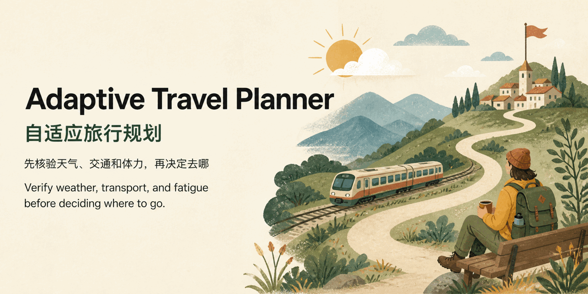

# Adaptive Travel Planner Skill



[](https://skills.sh/ryunana/adaptive-travel-planner-skill)

AI 推荐你去看风景，到了景区才发现下大雨，山也看不见。<br>
AI 推荐你去博物馆，到了门口才发现当天闭馆。<br>
AI 说可以坐高铁直达，真正买票时却找不到当天的直达车。<br>
AI 一天排了三个景点，第二个还没逛完，人已经走不动了。<br>
AI 推荐了一家酒店，选好日期才发现没房，价格也完全不是攻略里写的那样。

AI 会做攻略，但它排计划时，往往默认天会晴、门会开、车会有票，人也不会累。

这就是我做这个 Skill 的原因。

它不是为了再生成一份更长的攻略，而是让 Agent 在推荐之前尽量先查清天气、开放状态、真实交通、酒店和行程强度。查不到就明说，需要登录的就等用户确认。条件不合适，就换个方案、改天再去，或者干脆取消。

它不保证旅行一定顺利，天气会变、库存会动，但至少不会让你带着一份默认一切顺利的计划出门。

## 快速开始

下面使用 Vercel Labs 的 [`skills`](https://github.com/vercel-labs/skills) 安装器，需要 Node.js `>=22.20.0`。Codex 的 Skill 格式和官方用户目录说明见 [Build Skills 文档](https://developers.openai.com/codex/build-skills)。

```bash
npx skills add ryunana/adaptive-travel-planner-skill -g -a codex -y
```

> **完整使用前提：**宿主 Agent 必须至少具备一种可工作的网页搜索或交互式浏览能力。安装这个 Skill 不会自动安装搜索 API；如果两种能力都不可用，只能使用受限模式，无法通过用户提供的当前证据核验的天气、开放状态、交通、价格和库存必须保留为 `unknown` 或 `login_required`。

安装后可以直接这样问：

```text
我有 8 天时间，夏天从上海出发，正在考虑北疆、甘南和滇西北。
先把它们整理成 8 天内可比较的路线，核验天气、交通和人流风险，淘汰不适合本次旅行的选项；
只为第一名做完整日程，第二名给简要切换路线。查不到的动态信息请标为 unknown 或 login_required，不要估算。
```

它会先归一化候选路线、检查硬门槛和证据状态，再给出排序。不会为了显得完整而编造票价、余票、天气或开放状态。

想让规划长期贴合你的作息、体力和偏好，可以继续阅读下方的私人画像设置；不使用 Agent Skill 的平台也有可复制的便携提示词。

## 为什么做这个 Skill

常见的 AI 行程看起来完整，但执行时经常出现这些问题：

- 只看城市天气，不看山顶、峡谷或景区的逐小时天气；
- 雨天安排纯室外景区，高温预警下安排长时间暴晒；
- 把不存在的直达高铁、过时班次和估算价格写成事实；
- 多景区套票平均分配体力，反而错过真正不可替代的核心项目；
- 默认每天早出晚归，忽略真实作息、步数、海拔和驾驶疲劳；
- 因为景点有名、票已经买了或“来都来了”而拒绝取消；
- 推荐酒店时先凭品牌列名单，最后才发现日期没房或价格完全不同；
- 给出三个看似不同、实质相同的方案，却不做明确推荐。

这个 Skill 的目标不是生成更长的攻略，而是让行程决策更接近一个可靠的现场判断。

## 它会做什么

1. **先过当前状态门槛**：日期、位置、已完成项目、现有订单、疲劳、行李和最晚决策时间。
2. **把天气和景区类型绑定**：区分能见度敏感型室外、普通室外、室内外混合和室内项目。
3. **核查真实路线**：检查直达服务、换乘、首末段、行李和不必要折返。
4. **计算复合负荷**：同时考虑早起、步行、爬升、海拔、高温、降雨、驾驶和恢复时间。
5. **保护体验密度**：默认每天一个核心项目，把不可替代的项目放在最前。
6. **比较真正不同的选项**：留下等待、附近替换、换城市、下次再来。
7. **给出明确去留结论**：值得专程、适合顺路、条件成立才去、取消或延期。
8. **记录实际反馈**：把目的地潜力和本次天气、人流下的实际体验分开。

## 它不会做什么

- 不保证替你完成订票、付款或酒店预订；
- 不在查询失败后猜测票价、班次、开放状态或天气；
- 不把社交平台帖子当作官方安全或闭园信息；
- 不把大众热度自动当作个人适配度；
- 不要求你公开健康数据、账单、订单、同行者身份或完整轨迹；
- 不把一个人的个人画像当作所有人的旅行标准。

## 工作流程


## 五分钟开始使用

### 1. 获取仓库

```bash
git clone https://github.com/ryunana/adaptive-travel-planner-skill.git
cd adaptive-travel-planner-skill
```

### 2. 创建你的私人画像

```bash
cp templates/traveler-profile.template.md references/traveler-profile.md
```

填写 `references/traveler-profile.md`。这个文件已被 `.gitignore` 排除，正常情况下不会进入 Git 提交。

不需要一开始填得很完整。优先填写：

- 同行人数和行李；
- 正常起床与出发时间；
- 每天适合几个核心项目；
- 步行、高海拔和自驾边界；
- 喜欢与反感的体验；
- 同行者的身体或心理边界；
- 3至5个高分、低分实际案例及原因。

### 3. 安装到支持 Agent Skill 的工具

Codex 的[官方 Build Skills 文档](https://developers.openai.com/codex/build-skills)使用 `$HOME/.agents/skills` 作为用户级 Skill 目录。要自动安装到该目录并关联 Codex，可以使用 Vercel Labs 的 `skills` 安装器（需要 Node.js `>=22.20.0`）：

```bash
npx skills add ryunana/adaptive-travel-planner-skill -g -a codex -y
```

也可以把当前仓库手工链接到官方用户级 Skill 目录：

```bash
mkdir -p ~/.agents/skills
ln -s "$(pwd)" ~/.agents/skills/adaptive-travel-planner
```

Hermes Agent 可将仓库放到或链接到 `$HERMES_HOME/skills/`，未自定义时通常是 `~/.hermes/skills/`。Claude Code 可按其当前文档放到 `~/.claude/skills/`。WorkBuddy 可放到用户级技能目录 `~/.workbuddy/skills/adaptive-travel-planner/`（目录名与 frontmatter `name` 一致，重启 WorkBuddy 生效）。

不同 Agent 工具的 Skill 目录和格式可能变化，请以对应工具的当前官方文档为准。核心内容位于 `SKILL.md` 和 `references/`，可以按需要迁移。`agents/openai.yaml` 只用于 Codex 元数据发现，不代表这个 Skill 只能在 Codex 中使用。

### 4. 在普通聊天 AI 中使用

如果平台不支持 Skill：

1. 打开 `templates/portable-prompt.template.md`；
2. 填写方括号中的信息；
3. 连同你的当前日期、位置和订单状态一起发给 AI。

## 怎么提问

适合的请求：

目的地还很模糊时，可以直接使用首屏示例：不必先选定城市，也不必让 AI 同时生成几份很快过期的详细行程。下面是其他常见场景。

```text
我明天下午从当前酒店出发。比较继续留在这里、去附近室内项目、直接换城市三个方案。
先核验逐小时天气、景区开放、真实交通和退改成本，再给明确推荐。
```

```text
审查这份行程。逐天检查天气和景区类型、是否存在路线折返、每天是否超过一个核心项目、
驾驶与步行是否叠加过量，并明确哪些城市应该砍掉。
```

```text
我已经走累了，明天还要开车。不要沿用原计划，重新比较休整、轻量项目和换城市。
```

不够有效的请求：

```text
给我一个某地三日游攻略。
```

这种请求缺少日期、当前状态和个人画像，AI很容易退回大众模板。

## 宿主搜索模式、Doubao 推荐与高德增强

完整的动态旅行规划必须依赖宿主 Agent 已有的网页搜索或交互式浏览能力。本仓库本身不要求单独配置搜索 API Key，但这不表示宿主可以没有搜索后端。安装这个 Skill 也不会自动安装、注册或配置任何搜索 API。

建议按任务路由 provider：

| 任务 | 推荐能力 |
|---|---|
| 中国大陆景区公告、交通政策、票价、开放时间和近期中文来源 | 宿主已配置并真实验证可用时，优先使用 [Doubao Search Custom](https://www.volcengine.com/docs/87772/2272953)；否则使用宿主默认网页搜索或交互式浏览器 |
| 英文技术文档、GitHub 和海外信息 | 宿主默认网页搜索（例如 Tavily）或交互式浏览器 |
| 已知官方页面 | 直接打开或提取原始页面，不用搜索摘要代替原文 |
| POI、坐标、驾车路线、距离和通行费 | 高德或当前地图能力 |

Doubao Search 是推荐 provider，不是强制依赖。它需要在宿主层单独注册、鉴权并验证；可参考火山引擎的 [AI 工具接入指南](https://www.volcengine.com/docs/87772/2297384)，并在使用前核对当前配额、计费和条款。搜索结果只用于发现来源，最终事实仍应回到政府、景区、交通运营方、气象或其他第一方页面核验。

如果所有网页搜索和交互式浏览能力都不可用，Skill 只能进入**受限模式**：继续做候选归一化、偏好匹配、负荷分析和行程结构审计，但所有无法核验的动态事实必须标为 `unknown` 或 `login_required`，不能把结果称为已经完成实时核验的可执行行程。

默认的**宿主搜索模式**不要求为本仓库额外配置 API Key。它使用 Agent 已有的搜索或浏览能力，按官方渠道优先的证据规则比较候选地；也能在高德不可用时继续工作。登录后才能看到的 12306、酒店或票务库存会明确标为 `login_required`，不会被猜测。

### 一次搜索失败不等于 `unknown`

搜索和浏览器是实时发现基础；高德只增强地图、POI 和驾车证据；12306、酒店和票务登录会话只在相关库存或规则影响决策时才是条件性核验通道。它们的重要性不同，不能互相冒充。

对于会改变排名、硬门槛、预订或可执行行程的动态事实，Agent 应遵守[有界合理穷尽协议](references/research-effort-contract.md)：明确的当前官方结果可以立即结束查询；否则在标记 `unknown` 前，至少进行三次实质不同的尝试、调整一次查询表达、覆盖官方/第一方与适合该领域的替代来源，并在一个通道失败后尝试另一个当前可用的搜索 provider 或交互式浏览器。确认只能登录后核验时应标为 `login_required`，而不是继续用公开摘要猜库存。

协议同时规定停止线：完成最低覆盖后连续两次没有新可信线索，或完成六次实质尝试，即可停止；如果在第六次边界出现新的高价值线索，最多再跟进一条最终路径，仍无法核验就停止。单个页面遇到验证码、限流、付费墙或平台限制，不构成早停；只要仍有安全且可用的 provider、来源类别或浏览器路径，就应继续切换。这样既减少“过早 unknown”，也避免无限搜索和低质量来源堆积。

可选的**高德增强模式**通过仓库内的官方 Web Service API 适配器，改善以下信息：

- 地址解析与坐标确认；
- 驾车路线、距离、预计时长和通行费参考；
- 城市级短期基础天气，作为气象与政府来源之外的辅助证据。

它**不会**提供或改善铁路余票、航班与酒店实时价格、景区票量、景区微气候和现场人流，也不能代替相关第一方渠道。尤其在出发前 **8至14天** 的天气决策窗口，高德增强模式没有承诺的预报覆盖增量；仍应使用正常预报来源观察趋势，并保持切换目的地的余地。

### 安全设置高德 Key

高德增强模式完全可选。如果网页搜索或交互式浏览已验证可用，不配置高德不影响宿主搜索模式；如果两者都不可用，仍然是受限模式。高德开放平台注册可能需要绑定手机号并完成实名认证；如果不方便注册，可以跳过本节。

愿意启用增强模式时，先在[高德开放平台](https://lbs.amap.com/api/webservice/guide/create-project/get-key)完成开发者认证，创建 **Web 服务** Key，再运行：

```bash
python3 scripts/setup_amap.py
python3 scripts/verify_amap.py
```

若选择不配置高德并且以后不再提示，无论当前处于宿主搜索模式还是受限模式，都只持久化该偏好（不会询问或修改 Key）：

```bash
python3 scripts/setup_amap.py --do-not-ask-again
```

设置脚本使用隐藏输入，不接受命令行参数中的 Key；配置保存在 `~/.config/adaptive-travel-planner/config.json`，并以仅当前用户可读写的权限原子写入。不要把 Key 粘贴到聊天、Issue、日志或仓库文件中。CI 等高级场景可以临时使用 `AMAP_API_KEY` 环境变量覆盖本地配置。安装文件存在不代表能力可用，只有地址解析、路线和基础天气三步真实验证通过后，才应标记为 `verified_working`。

## 标准输出应该包含什么

Skill 要求 AI 首先比较 2至3个**实质不同**的方案：

| 方案 | 预期体验 | 天气适配 | 门到门成本 | 复合负荷 | 切换弹性 | 最大风险 | 结论 |
|---|---|---|---|---|---|---|---|

“切换弹性”指行程中途调整的难易程度，例如能否跳过部分安排、改签或换线成本，以及附近是否有可用备选。

比较后必须给出排序和明确首选。

目的地未定时，比较结果会先展示原始候选、归一化后的本次路线与最少可行天数，再给出证据状态、硬门槛和评分。

> 以下内容仅用于展示输出结构。所有地名、天数和证据状态均为虚构示例，不代表这些目的地的当前事实，也不能据此做旅行决策。

| 排名 | 原始候选 → 本次比较形态 | 最少可行天数 | 动态证据 | 硬门槛 | 本次结论 |
|---:|---|---:|---|---|---|
| 1 | 滇西北 → 丽江—香格里拉 8 日 | 7 | 天气已核验；交通待用户确认余票 | `undecidable` | 条件成立时首选 |
| 2 | 甘南 → 兰州进出小环线 8 日 | 8 | 路线与天气已核验 | `pass` | 可切换备选 |
| — | 北疆大环线 → 无法压缩为 8 日 | 12 | 不进入评分 | `fail` | 延期，说明更合适窗口 |

状态码说明：`pass` 表示通过硬门槛，`fail` 表示不通过，`undecidable` 表示当前证据不足以判断，`pending_gates` 表示仍有待确认的硬门槛，`login_required` 表示需要登录后获取，`unknown` 表示未查到，`verified_working` 表示能力已经实际验证可用。

最终输出包含一句话排序结论、每个候选的证据比较、第一名完整日程、第二名简要路线与切换条件、延期理由、72 小时复核清单，以及所有未决硬门槛的 `pending_gates`。第二名不是可直接执行的旧备份；触发切换时需要重新核验超过 24 小时的动态信息。

以下字段是检索和核验目标，不是每次都能完整获取的保证。宿主搜索模式与高德增强模式都无法覆盖所有实时信息；逐小时天气、景区内部顺序、实时停车等信息在完成适用的有界搜索协议后仍缺少可靠来源时，必须标为 `unknown`。完整边界见 [references/capability-matrix.md](references/capability-matrix.md)。

每个核心项目还应包含：

- 为什么适合当前旅行者；
- 个性化预期评分与置信度；
- 室内或室外类型及天气敏感性；
- 可去与不可去的天气门槛；
- 逐小时天气、来源与查询时间；
- 开放、预约、退改规则及官方来源；
- 门到门路线、换乘、停车、行李和首末段摩擦；
- 步行、爬升、海拔、高温和驾驶负荷；
- 景区内部正确顺序；
- 中途退出、替代方案和最晚决策时间。

完整契约见 [references/planning-contract.md](references/planning-contract.md)。

## 动态信息的证据顺序

动态事实会变化，仓库不会内置任何永久有效的票价、班次或开放状态。建议优先级：

1. 景区、交通运营方、气象、应急或当地政府官方渠道；
2. 官方铁路/航司/地图/小程序/预订页面；
3. 主流本地预订平台；
4. 最近的社交平台内容和评论区，用于识别排队、停车、商业化和现场摩擦。

社交平台可以说明“现场可能很挤”，但不能替代官方闭园、安全和票务规则。

## 私人画像为什么不放进仓库

真正有效的旅行画像往往包含：

- 身体反应和体力边界；
- 同行者关系与恐惧项目；
- 饮食禁忌；
- 酒店和消费习惯；
- 实际订单、日期与轨迹；
- 高分和低分旅行案例。

这些信息对规划很有价值，但不应该默认公开。因此本项目只提供空白模板；实际画像保留在本地。详细建议见 [PRIVACY.md](PRIVACY.md)。

## 从一次旅行中学习

旅行结束后，不要只记录“去了哪里”，建议记录：

- 本次实际评分；
- 当天人流、天气和开放情况；
- 实际步行、驾驶和恢复时间；
- 最有惊喜或最失望的部分；
- 问题来自目的地本身，还是来自错误季节、天气、顺序或交通方式。

例如，同一个山景目的地可以同时拥有“晴天潜力9分”和“本次大雾实际5分”。把两者分开，AI才不会因为一次坏天气永久排除目的地，也不会忽略再次踩坑的条件。

## 常见问题

### 运行安装命令时提示找不到 `npx`

Vercel Labs 的 `skills` 安装器需要 Node.js `>=22.20.0`。安装或升级 Node.js 后重新打开终端，再运行首屏命令；也可以跳过 `npx`，按上文把仓库手工链接到对应的 Skill 目录。

### 安装后 Agent 没有发现这个 Skill

确认 Skill 目录中存在 `adaptive-travel-planner/SKILL.md`，然后新建或重启 Agent 会话。不同工具的扫描目录可能变化，请以该工具当前文档为准。

### 安装后为什么仍然不能搜索

Agent Skill 是执行说明，不会自动附带网页搜索账号或 API。请先确认宿主 Agent 已启用一种可工作的网页搜索或交互式浏览能力；中国大陆动态事实可选用 Doubao Search Custom，其他可用 provider 也可以。若无法完成一次真实查询，请按受限模式处理，不要用模型记忆补齐动态事实。

### 高德验证失败怎么办

先运行 `python3 scripts/verify_amap.py` 查看哪一步失败。不要把 Key 粘贴到聊天、日志或 Issue。高德验证结果不会改变宿主搜索能力状态：如果网页搜索或交互式浏览已真实验证可用，继续使用宿主搜索模式；如果两者都不可用，保持受限模式。高德即使验证成功，也不能单独解除受限模式。

### 查不到票价、余票、开放状态或逐小时天气怎么办

保留 `unknown` 或 `login_required`，并把它列入出发前复核清单。不要用估算值或过期截图补齐表格。

## 项目结构

```text
.
├── SKILL.md                              # Agent 执行入口
├── README.md                             # 使用与设计说明
├── PRIVACY.md                            # 隐私与脱敏建议
├── CONTRIBUTING.md                       # 同好贡献说明
├── LICENSE
├── agents/
│   └── openai.yaml                        # Codex 发现元数据
├── docs/specs/
│   └── 2026-08-07-china-destination-selection-v2-design.md
├── references/
│   ├── capability-matrix.md               # 宿主搜索、受限模式与高德能力边界
│   ├── destination-selection.md           # 候选地筛选流程
│   ├── planning-contract.md               # 输出、核验与审计契约
│   ├── scoring-model.md                   # 硬门槛、评分与置信度
│   └── source-policy-cn.md                # 中国大陆动态信息来源策略
├── scripts/                               # 检测、设置、评分与校验脚本
├── templates/
│   ├── portable-prompt.template.md        # 普通聊天 AI 提示词
│   ├── traveler-profile.template.md       # 私人画像空白模板
│   └── trip-brief.template.md             # 目的地决策简报模板
├── tests/                                 # 无真实 Key 的 fixture 测试
└── examples/
    └── fictional-traveler-profile.md     # 完全虚构的填写示例
```

## 欢迎同好一起完善

欢迎提交 Issue 或 Pull Request，尤其是：

- 不同旅行方式的画像字段，例如亲子、长辈、徒步、摩旅或无障碍旅行；
- 不同国家和地区的可靠动态信息来源；
- 天气与景区类型错配的真实踩坑模式；
- 更清晰的行程负荷和退出方案表达；
- 不包含私人数据的虚构示例。

请不要在 Issue 中上传身份证件、订单二维码、酒店房号、健康导出、银行卡账单或可还原的完整轨迹。

## License

[MIT](LICENSE)
